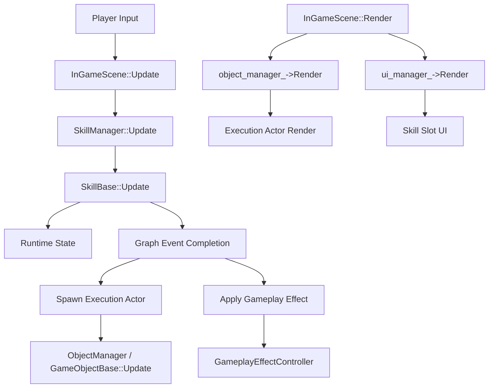

# 스킬 시스템 구조 및 데이터 작업 가이드

## 0. 문서 목적

이 문서는 현재 스킬 시스템에서 다음 두 가지를 정리한다.

1. 스킬의 실질적인 `Update`와 `Render` 경로가 어디인지
2. 개선된 그래프형 스킬 구조를 기준으로 데이터를 어떻게 작성하고 확장해야 하는지

---

## 1. 스킬의 실질적인 Update / Render 위치

### 1-1. Update 경로

스킬의 갱신은 아래 순서로 진행된다.

1. `InGameScene::Update()`가 프레임마다 호출된다.
2. 게임이 pause 상태가 아닐 때 `SkillManager::Update()`가 호출된다.
3. `SkillManager::Update()`가 장착된 각 `SkillBase` 인스턴스의 `Update()`를 호출한다.
4. `SkillBase::Update()`가 캐스팅 타이머, 쿨다운 타이머, 그래프 이벤트 완료 처리, 실행 상태를 갱신한다.
5. 월드에 남는 실행체는 `GameObjectBase::Update()` 경로를 따라 각 actor의 `Update()`에서 이동, 충돌, lifetime, 타깃 히트 정책을 처리한다.
6. 상태/버프/디버프는 `GameplayEffectController`가 대상 유닛의 업데이트 흐름 안에서 상태와 modifier를 유지한다.

핵심 위치는 아래 파일들이다.

- [InGameScene.cpp](C:/Users/user/Documents/GitHub/play-ground/PlayGround/Project/Gameplay/Scenes/InGameScene.cpp)
- [SkillManager.cpp](C:/Users/user/Documents/GitHub/play-ground/PlayGround/Project/Gameplay/GamePlaySystems/SkillManager.cpp)
- [SkillBase.cpp](C:/Users/user/Documents/GitHub/play-ground/PlayGround/Project/Gameplay/GamePlaySystems/Skills/SkillBase.cpp)
- [SkillExecutionActors.cpp](C:/Users/user/Documents/GitHub/play-ground/PlayGround/Project/Gameplay/GamePlaySystems/Skills/SkillExecutionActors.cpp)
- [GameObjectBase.cpp](C:/Users/user/Documents/GitHub/play-ground/PlayGround/Project/Gameplay/Actors/GameObjectBase.cpp)
- [GameplayEffectController.cpp](C:/Users/user/Documents/GitHub/play-ground/PlayGround/Project/Gameplay/Components/GameplayEffectController.cpp)

### 1-2. Render 경로

스킬의 시각적 결과는 두 갈래로 나뉜다.

1. UI 표현
2. 월드 실행체 표현

UI는 `InGameScene::Render()`에서 `ui_manager_->Render()`를 타고, 스킬 슬롯 쿨다운 표시 등은 UI 위젯 렌더링으로 나온다.

월드 실행체는 `InGameScene::Render()`에서 `object_manager_->Render()`를 타고, 각 실행체가 `GameObjectBase::Render()`의 기본 그리기 로직을 사용한다. 현재 스킬 실행체는 별도 렌더 오버라이드보다 공통 `GameObjectBase::_DrawObjectShape()`와 컴포넌트 렌더에 기대는 구조다.

핵심 위치는 아래 파일들이다.

- [InGameScene.cpp](C:/Users/user/Documents/GitHub/play-ground/PlayGround/Project/Gameplay/Scenes/InGameScene.cpp)
- [GameObjectBase.cpp](C:/Users/user/Documents/GitHub/play-ground/PlayGround/Project/Gameplay/Actors/GameObjectBase.cpp)
- [SkillExecutionActors.cpp](C:/Users/user/Documents/GitHub/play-ground/PlayGround/Project/Gameplay/GamePlaySystems/Skills/SkillExecutionActors.cpp)
- [InGameSkillSlot.cpp](C:/Users/user/Documents/GitHub/play-ground/PlayGround/Project/Gameplay/UI/Widgets/InGameSkillSlot.cpp)

---

## 2. 개선된 스킬 구조 요약

현재 구조의 의도는 다음과 같다.

- `SkillDefinition`: 정적 정의. JSON 그래프에서 로드된다.
- `SkillRuntimeState`: 슬롯 단위 런타임 상태. 캐스팅, 쿨다운, 비활성 여부를 가진다.
- `SkillExecutionContext`: 한 번의 사용에 대한 문맥. 소유자, 조준 방향, 캡처 대상, 실행체 핸들 등을 가진다.
- `SkillBase`: 슬롯의 실행 런타임. 그래프를 해석하고 실행체와 효과를 만든다.
- `SkillExecutionActor`: 월드에 남는 실행체. 투사체, 장판, 공전체를 담당한다.
- `GameplayEffectController`: 상태, 면역, modifier, 지속 효과를 관리한다.

이 구조의 핵심은 “스킬별 클래스 분기”가 아니라 “데이터 정의 + 공통 실행기 + 공통 효과 시스템”으로 확장한다는 점이다.

### 구조 흐름도

---

## 3. 데이터 작업 가이드

### 3-1. 데이터의 책임 분리

스킬 데이터를 추가하거나 수정할 때는 아래 책임을 분리해서 생각한다.

- `SkillDefinition`: 스킬 이름, 쿨다운, 그래프 진입점, 노드 테이블, 바인딩 키
- `SkillGraphNode`: 실행 흐름, 캐스트, 스폰, 효과, 분기
- `ExecutionEntitySpec`: 투사체, 장판, 공전체의 물리적/시간적 특성
- `GameplayEffectSpec`: 상태, 버프, 디버프, 피해, 주기 피해, 반응

평면 필드를 직접 늘리는 방식보다, 의미가 같은 값은 반드시 해당 노드나 스펙으로 옮긴다.

### 3-2. 신규 스킬 작성 순서

1. `skill_id`를 고정한다.
2. `display_name`, `description`, `cooldown_sec`를 채운다.
3. `graph_entry_points`에서 `OnUseRequested`, `OnCastCompleted` 같은 시작점을 지정한다.
4. `node_table`에 노드를 추가한다.
5. 각 노드의 `execution_spec` 또는 `effect_spec`를 채운다.
6. 히트 정책이 필요하면 `SinglePerTargetLifetime`, `PerTargetInterval`, `EnterOnlyCapture`를 지정한다.
7. 바인딩 키가 필요하면 `binding_keys`에 추가한다.

### 3-3. 노드 설계 원칙

- `TimedCast`는 비즉시 시전이다.
- `InstantCast`는 즉시 시전이다.
- `SpawnProjectile`, `SpawnAreaField`, `SpawnOrbiters`는 실행체 생성만 담당한다.
- 피해와 반응은 `ApplyEffect` 또는 `on_hit_effect_`로 공통 효과 시스템을 통해 들어간다.
- Root, Invincible, KnockbackImmune, MoveInputLocked, CastLocked는 효과 태그로 표현한다.

### 3-4. 스킬별 작성 예시

#### 먼지 돌풍

- 목적: 관통 투사체, 동일 대상 1회 타격
- 권장 흐름: `OnUseRequested -> TimedCast -> OnCastCompleted -> SpawnProjectile`
- 실행체 설정: `Projectile`, `SinglePerTargetLifetime`, `destroy_on_hit = false`

#### 부식

- 목적: 0.5초 확장 장판, enter 기반 캡처, Root + 주기 피해
- 권장 흐름: `OnUseRequested -> InstantCast -> SpawnAreaField`
- 실행체 설정: `AreaField`, `EnterOnlyCapture`, `grow_duration_sec = 0.5`
- 효과 설정: `Root`, `PeriodicDamage`, `no immediate damage`

#### 다크사이트

- 목적: 즉시 무적, 넉백 면역, 이동속도 증가, 즉시 속도 반영
- 권장 흐름: `OnUseRequested -> InstantCast -> ApplyEffect -> ApplyVelocityBoost`
- 효과 설정: `Invincible`, `KnockbackImmune`, `MoveSpeedMultiplier`

#### 보풀 위성

- 목적: 공전 실행체, 대상별 0.5초 간격 히트
- 권장 흐름: `OnUseRequested -> TimedCast -> OnCastCompleted -> SpawnOrbiters`
- 실행체 설정: `Orbiting`, `PerTargetInterval = 0.5`

---

## 4. 수정 시 주의점

- 스킬별 `if/switch`를 다시 넣지 않는다.
- 실행체 안에 스킬 고유 로직을 넣지 않는다.
- 피해를 직접 계산해서 우회하지 않는다.
- `Movement::SetEnable(false)`로 Root를 흉내내지 않는다.
- 상태/버프/디버프는 `GameplayEffectController`를 통해 처리한다.
- 렌더는 가능하면 실행체 공통 렌더 경로를 사용하고, 스킬마다 별도 렌더 클래스를 만들지 않는다.

---

## 5. 운영 체크리스트

새 스킬을 넣기 전에 아래를 확인한다.

- 그래프 진입점이 정확한가
- 실행체 타입이 공통 종류 안에 들어가는가
- 히트 정책이 공통 정책으로 표현되는가
- 상태 태그와 modifier가 효과 시스템으로 처리되는가
- UI에 필요한 정보가 `SkillDefinition`만으로 충분한가

---

## 6. 결론

현재 스킬 구조에서 실질적인 갱신은 `InGameScene -> SkillManager -> SkillBase -> ExecutionActor` 체인에서 일어나고, 렌더는 `InGameScene -> ObjectManager/UIManager` 체인에서 일어난다.  
따라서 스킬 데이터 작업은 “실행 로직”이 아니라 “정의와 노드 스펙”을 늘리는 방향으로 진행해야 한다.
