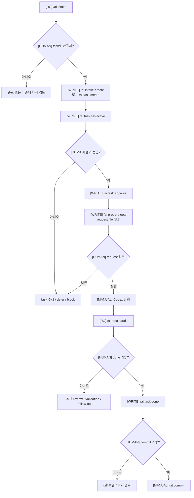
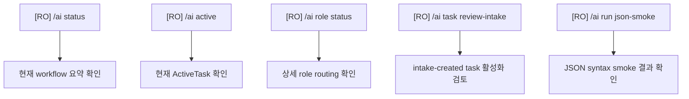
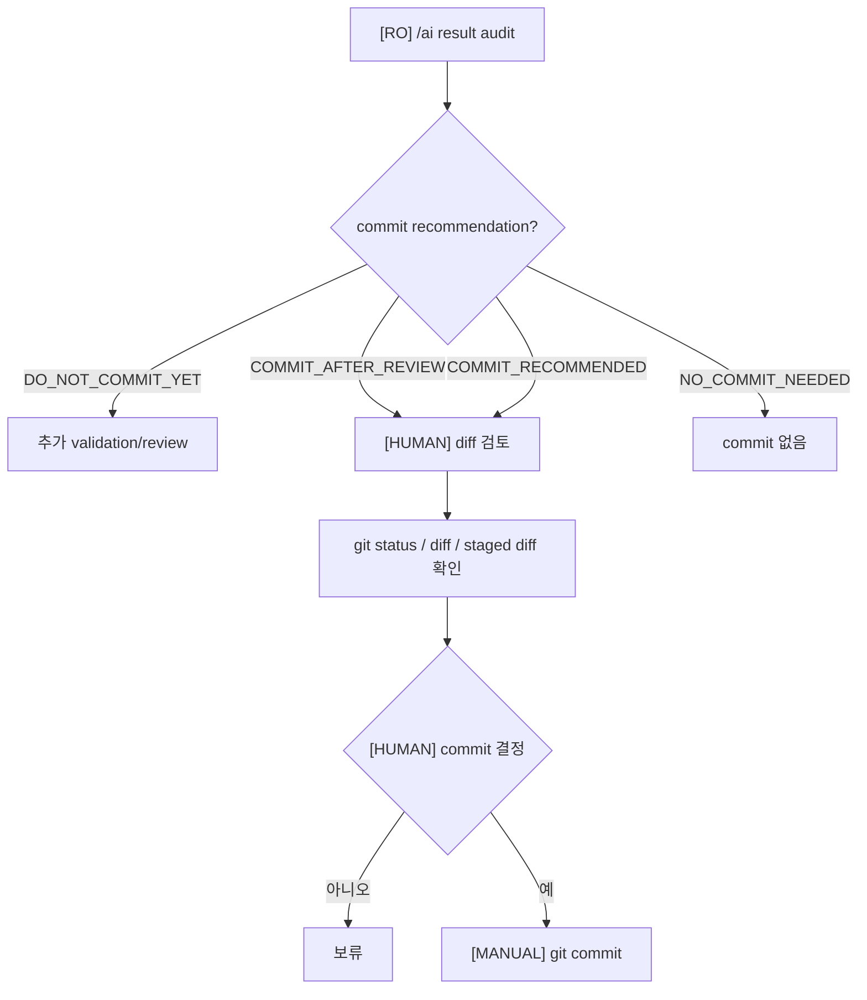

# AIWorkflow 운영 Flowchart

## 목적

이 문서는 실제로 Discord AIWorkflow를 사용할 때 어떤 순서로 명령을
실행하는지 보여줍니다.

표시 기준:

- `[RO]`: read-only, 상태를 쓰지 않음
- `[WRITE]`: Backlog 또는 ActiveTask 같은 workflow state를 씀
- `[HUMAN]`: 사람이 판단하거나 직접 실행
- `[MANUAL]`: Discord 밖에서 직접 수행

---

## Main Happy Path



핵심:

- `/ai prepare goal`은 Codex를 실행하지 않습니다.
- `/ai result audit`은 done 처리하지 않습니다.
- `/ai task done`은 commit하지 않습니다.
- commit은 사람이 diff와 validation을 보고 따로 결정합니다.

---

## Read-only / Inspection Path



이 경로는 정규 작업 흐름에 항상 필요하지 않습니다.

사용할 때:

- 현재 상태를 빠르게 보고 싶을 때
- role/gate/validation 세부 정보가 필요할 때
- intake-created task가 바로 active로 가도 되는지 확인할 때
- data 작업 전후 JSON syntax를 확인할 때

---

## Missing Validation Exception Path


주의:

- build 성공만으로 모든 validation이 끝난 것은 아닙니다.
- runtime/manual validation이 필요한 작업은 사람이 실제 결과를 제공해야 합니다.
- validation을 안 했으면 "안 했다"고 기록해야 합니다.

---

## Commit Decision Path



Commit recommendation은 자동 commit 명령이 아닙니다.

사람이 확인해야 하는 것:

- 변경 파일이 task scope 안에 있는지
- source/data/private file이 의도치 않게 포함되지 않았는지
- validation evidence가 실제로 있는지
- staged diff가 의도한 내용인지

---

## Command Type Summary

| Command | Type | 용도 |
|---|---|---|
| `/ai intake` | RO | 자연어 요청을 task draft로 정리 |
| `/ai intake-create` | WRITE | Backlog task 생성 |
| `/ai task create` | WRITE | 수동 Backlog task 생성 |
| `/ai task set-active` | WRITE | ActiveTask 선택 |
| `/ai task approve` | WRITE | 구현 승인 상태 기록 |
| `/ai prepare goal` | WRITE | `_Temp`에 goal request 파일 생성 |
| `/ai result audit` | RO | Codex 결과 요약 감사 |
| `/ai task done` | WRITE | evidence와 함께 완료 상태 기록 |
| `/ai role status` | RO | 상세 role routing 확인 |
| `/ai task review-intake` | RO | intake-created task 활성화 검토 |
| `/ai status` | RO | 전체 상태 요약 |
| `/ai active` | RO | 현재 ActiveTask 확인 |
| `/ai run json-smoke` | RO/report | JSON smoke validation 실행 및 report 생성 |
| `/ai run capture-diff` | WRITE `_Temp` | diff report 생성, `include-untracked`는 index metadata 주의 |

---

## Human Decision Gates

아래 상황에서는 사람이 멈춰서 판단해야 합니다.

- source code 구현 전
- JSON schema 또는 save/load 변경 전
- runtime behavior 변경 전
- scene/actor lifecycle 변경 전
- build setting 변경 전
- workflow rule 변경 전
- destructive command 필요 시
- validation 누락을 허용할지 결정할 때
- done 처리할 때
- commit할 때

---

## 운영 팁

정규 흐름에서는 `/ai role status`를 매번 실행할 필요가 없습니다.

`/ai prepare goal`이 최종 실행 준비 확인이고, 자세한 role/path/validation
내용은 generated `goal_request_*.md` 안에 들어 있습니다.

헷갈릴 때는 아래 세 개만 먼저 봅니다.

```text
/ai status
/ai active
/ai task list
```

