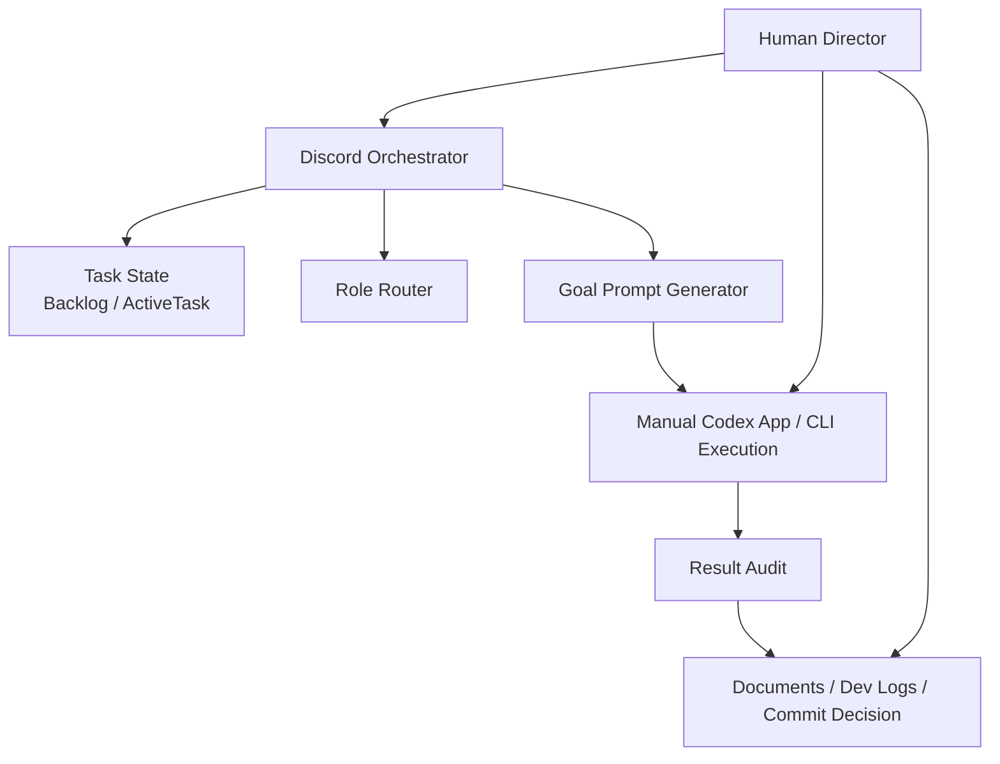

# AIWorkflow 개요

## 목적

AIWorkflow는 혼자 개발하는 게임 프로젝트에서 AI 도구를 안전하게 쓰기
위한 작업 운영 체계입니다.

핵심 목표는 단순합니다.

- 할 일을 Backlog에 기록한다.
- 지금 할 일을 ActiveTask로 고른다.
- 사람이 승인한 범위만 Codex에 넘긴다.
- Codex 결과를 바로 완료/커밋하지 않고 감사한다.
- 검증 증거가 있을 때만 done과 commit을 판단한다.

Discord Orchestrator는 이 흐름을 도와주는 인터페이스입니다. Discord가
Codex를 직접 실행하거나, commit하거나, game source를 고치는 구조가
아닙니다.

---

## 현재 intake와 실행 방식

현재 `/ai intake`는 로컬 Codex CLI `codex exec`를 사용해 TaskDraft JSON
후보를 생성하고, 로컬 검증 후 Backlog task를 생성하는 LLM-assisted intake
entry point입니다. 기본 모델은 `gpt-5.5`이며, API key 환경 변수는 필요하지
않습니다. 기존 키워드/rule-based 분류기는 baseline과 mismatch 감지 역할로
유지됩니다.

따라서 `/ai intake`는 다음 용도로 사용합니다.

```text
아이디어를 Backlog 후보로 만들기 전 LLM-assisted task draft를 얻는 용도
LLM 실패/비활성/API key 누락 시 rule-based fallback draft를 얻는 용도
```

다음 용도로 사용하지 않습니다.

```text
아키텍처 판단
저장소 문맥 분석
자동 승인
자동 실행
```

복합 작업의 경우 `/ai intake`가 확인 질문과 cross-check mismatch를 표시할 수
있지만, 최종 범위와 승인 여부는 Human Director가 결정합니다. 필요한 경우
ChatGPT 또는 Codex App에서 먼저 작업 의도, 범위, non-goals, validation 기준을
정리한 뒤 `/ai intake` 또는 `/ai task create`로 Backlog에 기록합니다.

LLM-assisted intake가 도입된 현재도 책임은 분리합니다.

```text
LLM:
  TaskDraft JSON 제안, 누락 질문, 위험 후보, validation 후보 생성

Workflow harness:
  schema 검증, rule-based cross-check, Backlog write, ActiveTask write,
  approval 기록, result audit, safety guard

Human Director:
  task 생성, 활성화, 승인, 실행, done, commit 최종 결정
```

LLM-assisted intake는 제안 품질을 높이는 계층일 뿐이며 Backlog 생성,
ActiveTask 변경, approval, Codex 실행, done, commit을 자동으로 수행해서는
안 됩니다.

---

## 전체 구조



---

## 주요 계층

### Human Director

사람이 최종 결정을 내립니다.

결정하는 것:

- 이 요청을 task로 만들지
- 어떤 task를 active로 둘지
- 구현을 승인할지
- Codex 결과를 받아들일지
- validation 누락을 허용할지
- done 처리할지
- commit할지

AIWorkflow에서 가장 중요한 원칙은 승인, 실행, 완료, commit이 자동으로
이어지지 않는다는 점입니다.

### Discord Orchestrator

Discord 명령으로 workflow 상태를 읽고, task를 만들고, prompt 파일을
생성합니다.

실행하는 것:

- Backlog task 생성
- ActiveTask 선택
- task approval/done/block/defer 상태 기록
- goal request markdown 생성
- result summary 감사

실행하지 않는 것:

- Codex CLI 실행
- agent 실행
- game source 수정
- commit/push/release

### Task State

작업 상태는 문서로 남습니다.

- `Backlog.md`: 후보 작업 목록
- `ActiveTask.md`: 현재 선택된 작업
- `ProjectStatus.md`: 프로젝트/워크플로우 상태 요약

Task State는 workflow의 기록입니다. 실제 구현은 Codex나 사람이 따로
수행합니다.

### Role Router

Role Router는 task 성격을 보고 어떤 관점의 검토가 필요한지 추천합니다.

예:

- gameplay 작업이면 Technical Architect, Reviewer, Validator 필요
- Discord/tool 작업이면 Tool/Workflow Engineer 필요
- 문서 작업이면 Documentation Keeper 필요

Role Router는 추천만 합니다. agent를 실행하지 않습니다.

### Goal Prompt Generator

`/ai prepare goal`은 Codex CLI에 붙여 넣을 markdown 요청 파일을 만듭니다.

기록하는 것:

- 목표
- 범위
- 금지 사항
- validation 계획
- role routing 요약
- path-scoped rules
- completion audit 기준

중요: Discord는 파일만 생성합니다. Codex 실행은 사람이 직접 합니다.

### Codex App / CLI Execution

Codex App 또는 Codex CLI 실행은 수동입니다.

사람이 generated `goal_request_*.md`를 열고 검토한 뒤 Codex App 또는
Codex CLI에 붙여 넣습니다. Discord는 Codex를 직접 실행하지 않습니다.

Codex가 작업을 끝내면 결과 요약을 다시 Discord나 ChatGPT에 가져옵니다.

### Result Audit

`/ai result audit`은 Codex 결과 요약을 검사합니다.

확인하는 것:

- 어떤 파일이 바뀌었다고 주장하는지
- validation 증거가 있는지
- 누락된 증거가 있는지
- done 처리 가능한지
- commit을 고려해도 되는지

Result Audit은 읽기 전용입니다. 자동으로 done 처리하거나 commit하지
않습니다.

### Documents and Logs

문서와 로그는 추적성을 위해 남깁니다.

- workflow 규칙: `_Docs/AIWorkflow/`
- 작업 로그: `_DevLog/WorkLog/`
- 수정 로그: `_DevLog/FixLog/`
- 회고: `_DevLog/Retrospective/`

검증하지 않은 내용을 검증 완료처럼 기록하면 안 됩니다.

---

## 책임 구분

| 계층 | 결정 | 실행 | 기록 |
|---|---|---|---|
| Human Director | 최종 승인, done, commit | 수동 Codex 실행, 수동 검증 | 승인/검증 증거 제공 |
| Discord Orchestrator | 추천 없음, 상태 전환은 명령 시만 | 명시된 workflow write | Backlog, ActiveTask, request file |
| Role Router | 역할 추천 | 실행 없음 | routing summary |
| Goal Prompt Generator | 실행 준비도 판단 | markdown 생성 | `_Temp/AIWorkflowTaskRequests/` |
| Codex | 요청 범위 내 분석/구현 | 수동 실행 후 작업 | 결과 요약 |
| Result Audit | 완료/commit 판단 보조 | 읽기 전용 감사 | audit response |

---

## 정규 흐름

일반 작업은 아래 흐름을 기본으로 사용합니다.

```text
1. /ai intake
2. /ai intake 또는 /ai task create
3. /ai task set-active
4. /ai task approve
5. /ai prepare goal
6. 사람이 Codex App 또는 Codex CLI를 수동 실행
7. /ai result audit
8. /ai task done
9. 사람이 diff 검토 후 commit 결정
```

---

## 기억할 원칙

- `/ai intake`는 읽기 전용입니다.
- `/ai intake`는 Backlog에 씁니다.
- `/ai task set-active`는 ActiveTask에 씁니다.
- `/ai task approve`는 approval 상태를 기록합니다.
- `/ai prepare goal`은 request file만 만듭니다.
- Codex App/CLI 실행은 수동입니다.
- `/ai result audit`은 읽기 전용입니다.
- `/ai task done`은 사람이 evidence를 넣어 완료 처리합니다.
- commit은 항상 수동 결정입니다.
# 2026-05-11 intake automation update

`/ai intake text:<request>` is the current no-paste intake entry point. It calls
local `codex exec` through the signed-in Codex CLI, receives a TaskDraft JSON
candidate, validates it locally, cross-checks it against the deterministic
rule-based baseline, and creates one Backlog task.

This replaces the earlier OpenAI API-key based intake plan. The current default
path does not require `OPENAI_API_KEY` and does not require the user to paste the
request into ChatGPT Web or Codex App. `/ai intake-preview` is the read-only
draft path.

The automation stops after Backlog creation. ActiveTask selection, approval,
implementation execution, result audit, done, and commit remain separate human
gated workflow steps.
