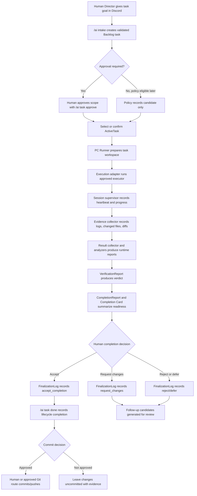

# WF End-to-End Workflow Technical Specification

## Purpose

This document is the source-of-truth technical specification for the
post-WF-309 Discord-first AIWorkflow operating model.

It describes:

- the full workflow from task request to commit decision
- where the Human Director must intervene
- which layer owns each state transition
- which runtime artifacts are created
- which paths are normal, diagnostic, manual escalation, or future runner-owned
- how Phase 4 should move from bootstrap operation to PC Runner orchestration

This document does not remove commands, implement runner automation, approve
tasks, mark tasks done, commit, push, or change game source/data files.

## System Definition

The project is a Discord-first PC Runner-based AI development workflow harness.

Discord is the primary user interface. The Human Director gives goals, reviews
approval prompts, checks progress, makes completion decisions, and decides
commit/push through Discord or an explicitly approved manual channel.

The PC Runner owns execution-oriented work:

- task workspace creation
- executor selection
- guarded command execution
- session supervision
- progress and heartbeat collection
- file watching and diff snapshots
- evidence collection
- result collection
- diff analysis
- build/test command execution through allowlisted command IDs
- verification report generation
- completion report/card generation
- finalization record creation after explicit human decision
- auto-approval policy evaluation only
- follow-up candidate generation only

## Responsibility Boundaries

| Layer | Owns | Must not own |
| --- | --- | --- |
| Human Director | goals, approvals, final completion decision, commit/push decision, destructive cleanup approval | runtime evidence collection |
| Discord Orchestrator | user interface, task state commands, approval records, response cards, command safety | hidden implementation work or unapproved execution |
| Task Lifecycle State | Backlog, ActiveTask, approval, blocked/deferred/done state | per-session runtime status |
| Runtime Workspace | task-scoped runtime files under `_Temp/AIWorkflowRuntime/` | durable workflow decisions |
| Session Supervisor | session state, heartbeat, activity, progress projection | pass/fail judgment |
| Execution Adapter | controlled process execution only | verification, completion, approval, commit |
| Evidence Collector | logs, changed files, diff references, evidence metadata | pass/fail judgment |
| Verification Gate | evidence-based verdict | task approval or done state |
| Completion/Finalization | review summary and explicit final decision records | automatic Backlog lifecycle transitions |
| Auto Approval Policy | deterministic eligibility evaluation | applying approval automatically unless separately approved |
| Follow-up Generator | reviewable follow-up candidates | creating Backlog tasks automatically |

## End-to-End Happy Path



## Current Bootstrap Path

Before WF-407 implemented the unified PC Runner orchestration entrypoint, some
steps remained manual or semi-manual:

```text
1. /ai intake text:<request>
2. /ai task set-active id:<task_id>
3. /ai task approve id:<task_id> note:<scope>
4. /ai prepare goal id:<task_id> mode:<mode> context:<context>
5. Execute through approved Codex App/Codex CLI/manual escalation path
6. /ai result audit id:<task_id> result:<summary>
7. Generate or inspect verification/completion artifacts when available
8. /ai completion card id:<task_id>
9. /ai finalization accept/request-changes/reject/defer
10. /ai task done id:<task_id> evidence:<evidence>
11. Human commit/push decision
```

Bootstrap commands must be documented as temporary bridge or manual escalation
paths, not as the final architecture.

## Target PC Runner Path

After WF-407, the normal Human Director path is:

```text
1. /ai intake text:<request>
2. /ai task set-active
3. /ai task approve, only if policy requires approval
4. /ai runner plan
5. /ai runner start
6. review Completion Card
7. /ai finalization accept/request-changes/reject/defer
8. /ai runner continue
9. approve task done and commit/push only if needed
```

The runner entrypoint should call existing primitives internally and stop at
human gates. It must not bypass approval, finalization, done, or commit
authority.

## User Intervention Matrix

| Stage | Normal human action | Optional human action | Harness action |
| --- | --- | --- | --- |
| Intake | Provide request text | Clarify ambiguous request | Generate TaskDraft and Backlog task |
| Activation | Approve/set active when required by policy | Inspect intake review | Record selected task and approval state |
| Execution start | Approve risky or P0/P1 scope | Choose executor if multiple safe options exist | Prepare workspace and guarded execution |
| Runtime | Approve stop/retry/replan/scope reduction when required | Check progress or stalled state | Record heartbeat, progress, evidence |
| Verification | Review failed or blocked evidence | Request more validation | Produce VerificationReport |
| Completion | Accept, request changes, reject, or defer | Generate follow-up candidates | Produce CompletionReport/Card and FinalizationLog |
| Done | Confirm task can be marked done | Leave task open for follow-up | Update task lifecycle only through explicit command |
| Git | Decide commit/push | Request split commits | Git remains explicit and auditable |

## State and Artifact Paths

### Durable Workflow State

```text
_Docs/AIWorkflow/Backlog.md
_Docs/AIWorkflow/ActiveTask.md
_Docs/AIWorkflow/ProjectStatus.md
_Docs/AIWorkflow/ActiveProject.json
_Docs/AIWorkflow/ProjectProfiles/
```

Durable workflow state records task identity, lifecycle state, approval notes,
project selection, and workflow documentation. It should not store raw runtime
logs or transient executor output.

### Discord Bot Working Artifacts

```text
_Temp/AIWorkflowDiscordBot/backups/
_Temp/AIWorkflowDiscordBot/intake/
_Temp/AIWorkflowReports/
_Temp/AIWorkflowDiffs/
_Temp/AIWorkflowTaskRequests/
```

These are local artifacts for backups, intake output, report output, diff
captures, and generated goal/prompt request files. They are not durable source
of truth and should not be tracked.

### Runtime Workspace

```text
_Temp/AIWorkflowRuntime/tasks/<task_id>/
  workspace_metadata.json
  task_run_state.json
  progress_events.jsonl
  runtime_control_history.jsonl
  sessions/
  evidence/
    manifest.json
    records/
    logs/
    diffs/
    reports/
```

The runtime workspace is task-scoped and linked by `task_id`. It stores
execution state and evidence, not durable task approval.

### Report Artifacts

```text
_Temp/AIWorkflowRuntime/tasks/<task_id>/evidence/reports/
  result_manifest.json
  diff_analysis_manifest.json
  build_test/
  verification/
  completion/
  finalization/
  auto_approval/
  follow_up/
```

Reports are generated in sequence from observed evidence. Later reports may
read earlier reports, but they must not rewrite the authority boundary.

## Workflow Path Variants

### New Task Intake Path

```text
/ai intake text:<request>
-> Codex CLI assisted TaskDraft JSON
-> schema validation
-> rule-based cross-check
-> one Backlog task
-> stop
```

No ActiveTask update, approval, execution, done, commit, or push occurs during
intake.

### Existing Backlog Task Path

```text
/ai task set-active id:<task_id>
-> /ai task approve id:<task_id> note:<scope>
-> execution path
```

This path skips intake because the task already exists.

### Manual Escalation Path

```text
/ai prepare goal or /ai prepare codex
-> approved manual execution surface
-> /ai result audit
-> completion/finalization path
```

Manual escalation is allowed for bootstrap, adapter failure, authentication
failure, high-risk human-approved exceptions, or cases where the runner cannot
yet supervise the executor.

### PC Runner Execution Path

```text
task_workspace_manager
-> execution adapter
-> session_supervisor
-> file_watcher
-> evidence_collector
-> result_collector
-> diff_analyzer
-> build_test_runner
-> verification_report
-> completion_report/card
```

This path should become internal to the unified runner command.

### Runtime Control Path

```text
runtime_control_adapter request
-> human approve/reject when required
-> runtime_control_adapter apply
-> session/progress/control history updated
```

Pause, resume, stop, retry, replan, scope reduction, executor change, and
manual escalation are runtime controls. They do not approve tasks, mark done,
or commit.

### Completion and Finalization Path

```text
VerificationReport
-> CompletionReport
-> Completion Card
-> Human finalization decision
-> ApprovalHistory and FinalizationLog
-> explicit /ai task done if accepted
```

Completion evidence and finalization records prepare a done decision; they do
not automatically change Backlog lifecycle state.

### Follow-up Candidate Path

```text
CompletionReport / FinalizationLog / AutoApprovalPolicy
-> FollowUpPlan
-> reviewable task candidates only
```

Follow-up generation must not create Backlog tasks without a later explicit
intake/task-create step.

### Diagnostic and Admin Path

Diagnostic/admin commands inspect state, bot health, engine readiness, project
profile selection, and script output. They are not required in normal work and
must not be presented as normal workflow steps.

### Commit Decision Path

```text
review diff
-> confirm validation evidence
-> confirm DevLog when required
-> Human Director commit decision
-> commit/push through explicit Git route
```

Commit and push remain explicit. Automation may prepare recommendations, but
must not silently commit or push.

## Approval and Stop Rules

The workflow must stop for Human Director decision when:

- task risk or priority requires approval
- scope changes after approval
- data schema, runtime lifecycle, source implementation, or policy behavior is
  affected
- verification is blocked, failed, or incomplete
- a runtime control would stop, retry, replan, reduce scope, change executor, or
  escalate manually
- command removal, command hiding, metadata change, or workflow behavior change
  is proposed
- commit, push, release, or deploy is proposed

## Final-Form Reduction Rule

Reduced-scope implementation is allowed only when it is the same structure as
the final-form architecture.

Correct:

```text
final PC Runner orchestration
-> reduced implementation that calls existing primitives and stops at gates
```

Incorrect:

```text
temporary manual copy/paste workflow
-> future rewrite expected
```

Manual prompt preparation remains a bootstrap/manual-escalation path only.

## Required Handoff to WF-404

WF-404 should turn this technical specification into a Korean Human Director
operation guide. The guide should use the same path categories:

- normal workflow
- progress/review checks
- manual escalation
- admin/diagnostic commands
- completion and commit decision

WF-404 should not ask the Human Director to run every runtime primitive.
