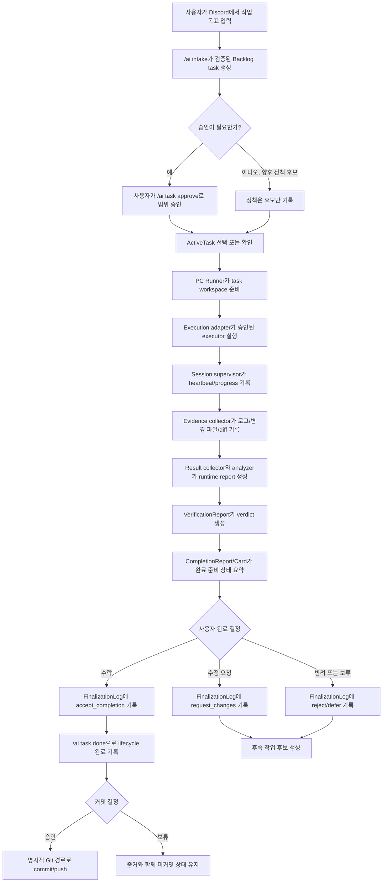

# WF 전체 워크플로우 기술 사양

## 목적

이 문서는 WF-309 이후 Discord 중심 AIWorkflow 운영 모델의 기술 기준
문서입니다.

설명하는 내용은 다음입니다.

- 작업 지시부터 커밋 결정까지의 전체 흐름
- 사용자가 반드시 개입해야 하는 지점
- 각 상태 전환의 책임 주체
- 생성되는 runtime artifact
- 정규 경로, 진단 경로, 수동 승격 경로, 향후 runner 내부 경로의 차이
- Phase 4가 bootstrap 운영에서 PC Runner 오케스트레이션으로 넘어가는 방식

## 시스템 정의

이 프로젝트는 Discord 중심 PC Runner 기반 AI 개발 워크플로우 하네스입니다.

Discord는 사용자 인터페이스입니다. 사용자는 Discord 또는 승인된 수동
채널에서 목표 제시, 승인, 진행 확인, 완료 리뷰, 최종화, 커밋/푸시 결정을
합니다.

PC Runner는 실행 쪽 책임을 가집니다.

- task workspace 생성
- executor 선택
- 안전한 명령 실행
- session supervision
- progress와 heartbeat 수집
- 파일 감시와 diff snapshot
- evidence 수집
- result 수집
- diff 분석
- allowlisted build/test 실행
- VerificationReport 생성
- CompletionReport와 Completion Card 생성
- 사람 결정 이후 FinalizationLog 기록
- Auto Approval Policy 평가만 수행
- Follow-up 후보 생성만 수행

## 책임 경계

| 계층 | 책임 | 하면 안 되는 일 |
| --- | --- | --- |
| Human Director | 목표, 승인, 완료 판단, 커밋/푸시 결정, 파괴적 정리 승인 | runtime evidence 직접 수집 |
| Discord Orchestrator | UI, task state 명령, 승인 기록, 응답 카드, 명령 안전성 | 승인 없는 구현 실행 |
| Task Lifecycle State | Backlog, ActiveTask, 승인, blocked/deferred/done | session runtime 상태 |
| Runtime Workspace | `_Temp/AIWorkflowRuntime/` 아래 task별 runtime 파일 | durable workflow 결정 |
| Session Supervisor | session 상태, heartbeat, activity, progress 표시 | pass/fail 판단 |
| Execution Adapter | 통제된 process 실행 | 검증, 완료, 승인, 커밋 |
| Evidence Collector | 로그, 변경 파일, diff reference, evidence metadata | pass/fail 판단 |
| Verification Gate | evidence 기반 verdict | task 승인 또는 done 처리 |
| Completion/Finalization | 완료 요약과 명시적 최종 결정 기록 | 자동 lifecycle 변경 |
| Auto Approval Policy | 조건부 자동 승인 후보 평가 | 별도 승인 없는 자동 적용 |
| Follow-up Generator | 후속 작업 후보 생성 | 자동 Backlog task 생성 |

## 전체 Happy Path



## 현재 Bootstrap 경로

WF-407에서 통합 PC Runner 진입점이 구현되기 전까지는 일부 단계가 수동 또는
반수동입니다.

```text
1. /ai intake text:<request>
2. /ai task set-active id:<task_id>
3. /ai task approve id:<task_id> note:<scope>
4. /ai prepare goal id:<task_id> mode:<mode> context:<context>
5. 승인된 Codex App/Codex CLI/manual escalation 경로로 실행
6. /ai result audit id:<task_id> result:<summary>
7. 가능한 경우 verification/completion artifact 생성 또는 확인
8. /ai completion card id:<task_id>
9. /ai finalization accept/request-changes/reject/defer
10. /ai task done id:<task_id> evidence:<evidence>
11. 사용자 커밋/푸시 결정
```

이 경로는 현재 bridge입니다. 최종 구조 자체로 보면 안 됩니다.

## 목표 PC Runner 경로

WF-406/WF-407 이후 목표는 다음입니다.

```text
1. /ai intake text:<request>
2. 정책상 필요한 경우에만 승인
3. 하나의 PC Runner orchestration entrypoint로 진행
4. 필요하면 진행 상황 확인
5. Completion Card 리뷰
6. accept/request changes/reject/defer 결정
7. 필요한 경우 커밋/푸시 승인
```

runner는 내부적으로 기존 primitive를 호출하되 사람 승인이 필요한 gate에서
멈춰야 합니다.

## 사용자 개입 매트릭스

| 단계 | 사용자의 기본 행동 | 선택 행동 | 하네스 행동 |
| --- | --- | --- | --- |
| Intake | 요청 텍스트 입력 | 모호한 요청 보완 | TaskDraft와 Backlog task 생성 |
| Activation | 필요한 경우 승인/set-active | intake review 확인 | 선택 task와 승인 상태 기록 |
| 실행 시작 | 위험하거나 P0/P1 작업 승인 | executor 선택 | workspace와 안전 실행 준비 |
| Runtime | 필요한 runtime control 승인 | 진행/정체 상태 확인 | heartbeat, progress, evidence 기록 |
| Verification | 실패/blocked evidence 리뷰 | 추가 검증 요청 | VerificationReport 생성 |
| Completion | accept/request changes/reject/defer | follow-up 후보 생성 | CompletionReport/Card와 FinalizationLog 생성 |
| Done | 완료 처리 확인 | 후속 작업 때문에 열어두기 | 명시적 명령으로만 lifecycle 변경 |
| Git | commit/push 결정 | 커밋 분리 요청 | Git은 명시적이고 감사 가능해야 함 |

## 상태와 artifact 경로

### Durable workflow state

```text
_Docs/AIWorkflow/Backlog.md
_Docs/AIWorkflow/ActiveTask.md
_Docs/AIWorkflow/ProjectStatus.md
_Docs/AIWorkflow/ActiveProject.json
_Docs/AIWorkflow/ProjectProfiles/
```

여기에는 task identity, lifecycle state, approval note, project selection,
workflow documentation이 들어갑니다.

### Discord bot working artifacts

```text
_Temp/AIWorkflowDiscordBot/backups/
_Temp/AIWorkflowDiscordBot/intake/
_Temp/AIWorkflowReports/
_Temp/AIWorkflowDiffs/
_Temp/AIWorkflowTaskRequests/
```

이 파일들은 로컬 임시 산출물입니다. 추적하지 않습니다.

### Runtime workspace

```text
_Temp/AIWorkflowRuntime/tasks/<task_id>/
  workspace_metadata.json
  task_run_state.json
  progress_events.jsonl
  runtime_control_history.jsonl
  sessions/
  evidence/
    manifest.json
    records/
    logs/
    diffs/
    reports/
```

runtime workspace는 `task_id`에 연결됩니다. approval의 source of truth가
아니라 실행 상태와 evidence를 저장하는 곳입니다.

## 주요 워크플로우 경로

### 새 작업 intake 경로

```text
/ai intake text:<request>
-> Codex CLI assisted TaskDraft JSON
-> schema validation
-> rule-based cross-check
-> Backlog task 1개 생성
-> 정지
```

intake 단계에서는 ActiveTask 변경, 승인, 실행, 완료 처리, 커밋, 푸시가
일어나면 안 됩니다.

### 기존 Backlog 작업 경로

```text
/ai task set-active id:<task_id>
-> /ai task approve id:<task_id> note:<scope>
-> 실행 경로
```

이미 task가 있으므로 intake는 건너뜁니다.

### 수동 승격 경로

```text
/ai prepare goal 또는 /ai prepare codex
-> 승인된 수동 실행 surface
-> /ai result audit
-> completion/finalization 경로
```

수동 승격은 bootstrap, adapter 실패, 인증 문제, high-risk 예외, runner가 아직
감시할 수 없는 executor에만 사용합니다.

### PC Runner 실행 경로

```text
task_workspace_manager
-> execution adapter
-> session_supervisor
-> file_watcher
-> evidence_collector
-> result_collector
-> diff_analyzer
-> build_test_runner
-> verification_report
-> completion_report/card
```

이 경로는 최종적으로 통합 runner 명령 내부에 들어가야 합니다.

### 런타임 제어 경로

```text
runtime_control_adapter request
-> 필요하면 사용자 approve/reject
-> runtime_control_adapter apply
-> session/progress/control history 갱신
```

pause, resume, stop, retry, replan, scope reduction, executor change,
manual escalation은 runtime control입니다. task approval, done, commit이
아닙니다.

### 완료와 최종화 경로

```text
VerificationReport
-> CompletionReport
-> Completion Card
-> 사용자 finalization decision
-> ApprovalHistory와 FinalizationLog
-> accepted인 경우 명시적 /ai task done
```

Completion evidence와 FinalizationLog는 done 결정을 준비합니다. 자동으로
Backlog lifecycle을 바꾸지 않습니다.

### 후속 작업 후보 경로

```text
CompletionReport / FinalizationLog / AutoApprovalPolicy
-> FollowUpPlan
-> reviewable task candidates only
```

Follow-up 생성은 Backlog task를 자동 생성하지 않습니다.

### 커밋 결정 경로

```text
diff 리뷰
-> validation evidence 확인
-> 필요한 경우 DevLog 확인
-> 사용자 commit decision
-> 명시적 Git 경로로 commit/push
```

커밋과 푸시는 계속 명시적이어야 합니다.

## 멈춰야 하는 지점

하네스는 아래 상황에서 사용자 결정을 기다려야 합니다.

- 작업 위험도나 우선순위상 승인이 필요함
- 승인 이후 scope가 바뀜
- data schema, runtime lifecycle, source implementation, policy behavior에 영향
- verification이 blocked, failed, incomplete
- stop, retry, replan, scope reduction, executor change, manual escalation 요청
- 명령어 제거, 숨김, metadata 변경, workflow behavior 변경 제안
- commit, push, release, deploy 제안

## WF-404로 넘길 내용

WF-404는 이 기술문서를 한국어 사용자 운영 가이드로 바꿔야 합니다.

가이드는 아래 분류를 유지해야 합니다.

- 정규 워크플로우
- 진행/리뷰 확인
- 수동 승격
- 관리/진단 명령
- 완료와 커밋 결정

사용자에게 모든 runtime primitive를 하나씩 실행하라고 요구하면 안 됩니다.
