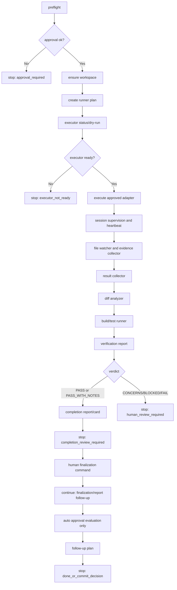

# WF-406 Unified PC Runner Orchestration Entrypoint Design

## Purpose

This document defines the approved design target for the unified PC Runner
orchestration entrypoint.

The goal is to make the normal workflow usable without asking the Human
Director to manually run every primitive command. The runner should call the
existing WF-201 through WF-309 primitives in the correct order, preserve approval
gates, collect evidence, produce review artifacts, and stop at human decision
points.

This is a design document only. It does not implement the runner, change command
behavior, remove commands, approve tasks automatically, mark tasks done
automatically, commit, push, or modify game source/data.

## Product Definition

The unified PC Runner is the local execution coordinator for the Discord-first
PC Runner-based AI development workflow harness.

It is not a chatbot and not a replacement for task governance. It is a controlled
local orchestrator that turns an already reviewed task into an auditable runtime
sequence.

## Final-Form User Flow

```text
1. Human Director creates or selects a task in Discord.
2. Policy determines whether approval is required.
3. Human Director approves scope when required.
4. Human Director starts the PC Runner once.
5. PC Runner prepares workspace, runs the approved executor, collects evidence,
   runs validation, and produces completion artifacts.
6. Human Director optionally checks progress.
7. Human Director reviews the Completion Card.
8. Human Director accepts, requests changes, rejects, or defers.
9. PC Runner records follow-up artifacts after the final decision.
10. Human Director decides whether to mark done and commit/push.
```

The Human Director should not need to copy prompts into Codex or run individual
runtime primitives during normal operation.

## Command Surface

### Local Entrypoint

WF-407 should implement one local runner command:

```text
tools\aiworkflow\pc_runner.bat <command> <task_id> [options]
```

Required commands:

| Command | Purpose | Writes runtime artifacts | Writes lifecycle state |
| --- | --- | --- | --- |
| `status` | Read current runner/task/runtime state. | no | no |
| `plan` | Build a dry-run step plan and identify gates. | yes, plan artifact | no |
| `start` | Start a new runner sequence after approval checks. | yes | no |
| `continue` | Continue from a checkpoint after an approved human decision or transient interruption. | yes | no |
| `stop` | Request or apply an approved stop path through Runtime Control. | yes | no |
| `read` | Read a specific runner run artifact. | no | no |

Optional future commands:

| Command | Purpose |
| --- | --- |
| `retry` | Request or apply a retry through Runtime Control. |
| `replan` | Request or apply a replan through Runtime Control. |
| `explain` | Summarize why the runner stopped. |

### Discord Surface

The Discord surface should stay small:

```text
/ai runner status id:<task_id>
/ai runner plan id:<task_id>
/ai runner start id:<task_id>
/ai runner continue id:<task_id>
```

Runtime control can either use a compact runner subcommand later or delegate to
the existing Runtime Control command surface. The normal user-facing surface
should not expose every local primitive.

## Runner Authority Model

The runner may:

- read Backlog and ActiveTask
- verify task approval state
- create or read a runtime workspace
- generate a runner plan
- call approved execution adapters
- call existing result, diff, build/test, verification, completion,
  finalization, auto-approval, and follow-up primitives
- write runtime artifacts under `_Temp/AIWorkflowRuntime/tasks/<task_id>/`
- write progress events and runner checkpoints
- summarize progress and completion state for Discord

The runner must not:

- create Backlog tasks automatically
- set ActiveTask automatically unless a separate user-facing command explicitly
  does that before runner start
- approve tasks automatically
- bypass P0/P1/high-risk approval gates
- mark tasks done automatically
- apply auto approval automatically
- commit, push, release, or deploy
- execute arbitrary user-provided shell commands
- change game source/data outside the approved task scope
- treat evidence collection as pass/fail judgment
- treat completion report generation as Human Director acceptance

## Runtime State Additions

WF-407 should add one runner-owned artifact family under the existing runtime
workspace:

```text
_Temp/AIWorkflowRuntime/tasks/<task_id>/runner/
  runner_manifest.json
  plans/
    runner-plan-<stamp>.json
  runs/
    runner-run-<stamp>.json
  checkpoints/
    checkpoint-<stamp>.json
```

### RunnerPlan

RunnerPlan is a dry-run artifact. It records the intended sequence before
execution.

Required fields:

```text
schema_version
task_id
runner_plan_id
profile
executor
approval_state
preflight_result
planned_steps[]
human_gates[]
stop_conditions[]
expected_artifacts[]
created_at
```

### RunnerRunState

RunnerRunState records a specific orchestration attempt.

Required fields:

```text
schema_version
task_id
run_id
runner_run_id
runner_plan_id
status
current_phase
current_step
last_checkpoint_id
session_ids[]
evidence_ids[]
report_ids
human_gate_state
runtime_control_state
started_at
updated_at
ended_at
```

### RunnerCheckpoint

RunnerCheckpoint allows `continue` to be deterministic.

Required fields:

```text
schema_version
task_id
runner_run_id
checkpoint_id
phase
step
status
inputs
outputs
next_step
stop_reason
created_at
```

## Profiles

The runner should support profiles instead of free-form command composition.

| Profile | Intended use | Executor | Validation |
| --- | --- | --- | --- |
| `analysis` | Read-only investigation and report generation. | Codex CLI or local read-only command | no build/test unless configured |
| `implementation` | Approved code/docs/tooling change. | Codex CLI first, Local CLI for allowlisted checks | required verification report |
| `validation` | Run allowlisted validation against existing work. | Local CLI/build-test runner | required build/test result |
| `documentation` | Documentation-only workflow work. | Codex CLI or local file edits through approved agent path | diff/markdown validation |

Profiles must be configured in `_Local/AIWorkflow/pc_runner.local.json` or a
tracked example file. Local config must not be tracked.

## Execution Phases



## Step Contract

Each runner step must have:

- stable step id
- primitive command or service it calls
- input artifact IDs
- output artifact IDs
- retry policy
- timeout policy
- allowed failure state
- next step on success
- stop reason on failure

The runner should not infer pass/fail from process exit codes alone. Exit codes
are evidence until VerificationReport judges them.

## ID Policy

WF-405 found that ID prefix rules are easy to misuse when humans call primitives
directly. The runner must generate IDs centrally.

Recommended ID patterns:

| Artifact | Pattern |
| --- | --- |
| runner plan | `runner-plan-<task_id>-<stamp>` |
| runner run | `runner-run-<task_id>-<stamp>` |
| checkpoint | `checkpoint-<task_id>-<phase>-<stamp>` |
| session | `session-<task_id>-<executor>-<stamp>` |
| evidence | `evidence-<task_id>-<source>-<stamp>` |
| result | `result-<task_id>-<stamp>` |
| analysis | `analysis-<task_id>-<stamp>` |
| build/test | `bt-<task_id>-<command_id>-<stamp>` |
| verification | `verification-<task_id>-<stamp>` |
| completion | `completion-<task_id>-<stamp>` |
| card | `card-<task_id>-<stamp>` |
| approval | `approval-<task_id>-<stamp>` |
| finalization | `finalization-<task_id>-<stamp>` |
| auto approval evaluation | `autoeval-<task_id>-<stamp>` |
| follow-up | `followup-<task_id>-<stamp>` |

The runner should call underlying PowerShell scripts with named parameters when
that is safer than a `.bat` positional wrapper.

## Preflight Gates

`pc_runner plan` and `pc_runner start` must check:

1. Task exists in Backlog.
2. ActiveTask matches the requested task or the command explicitly allows
   non-active dry-run planning.
3. Task status is approved/ready when execution would occur.
4. Requested profile is allowed for the task kind and risk.
5. Executor is available and configured.
6. Required local config exists under `_Local/`.
7. Runtime workspace can be created/read.
8. Git worktree state is recorded before execution.
9. No forbidden tracked paths are staged or modified by the runner.
10. Required stop conditions are registered.

Failure should produce a readable stop state, not partial execution.

## Human Gates

The runner must stop at these gates:

| Gate | Stop reason | Human decision |
| --- | --- | --- |
| Missing task approval | `approval_required` | approve, reject, or edit scope |
| Executor unavailable | `executor_not_ready` | fix config, switch executor, or manual escalation |
| Runtime control requested | `runtime_control_pending` | approve/reject/apply control |
| Verification CONCERNS/BLOCKED/FAIL | `verification_review_required` | accept risk, request changes, or retry/replan |
| Completion card ready | `completion_review_required` | accept, request changes, reject, or defer |
| Finalization recorded | `done_or_commit_decision` | mark task done and decide commit/push |
| Auto approval candidate only | `auto_approval_candidate_review` | explicitly approve future policy change or ignore |

## Runtime Control Integration

The runner must poll Runtime Control state between major steps and while waiting
for long-running sessions.

Supported controls:

- pause
- resume
- stop
- retry
- replan
- reduce scope
- change executor
- add stop condition

Controls are not free-form commands. They must be structured
RuntimeControlIntent/RuntimeControlRecord artifacts and must follow the existing
approve/reject/apply model.

## Executor Selection

The first supported executors are:

- `codex_cli`
- `local_cli`

The runner should select executor by profile and task route:

| Task/profile | Preferred executor |
| --- | --- |
| analysis | `codex_cli` when available, otherwise manual escalation |
| implementation | `codex_cli` for AI implementation, `local_cli` for allowlisted checks |
| validation | `local_cli` and `build_test_runner` |
| documentation | `codex_cli` or approved Codex App manual escalation during bootstrap |

Codex App, Copilot, OpenClaw, and Hermes remain future candidates until the PC
Runner can track start/end, collect logs, identify sessions, detect failure and
timeout, collect changed files/diffs, and enforce approval policy.

## Progress Output

The runner should expose a compact progress card:

```text
WF-406 - runner active
phase: verification
last step: build_test_runner run json_smoke exited 0
current gate: none
changed files: 3
latest report: verification-...
next: completion card
```

Progress is display-only. It must not decide pass/fail, apply controls, or mark
tasks complete.

## Error Handling

Errors must become typed stop states:

| Error class | Stop state |
| --- | --- |
| Missing approval | `approval_required` |
| Missing config | `configuration_required` |
| Executor missing | `executor_not_ready` |
| Duplicate artifact ID | `artifact_conflict` |
| Primitive wrapper failure | `primitive_call_failed` |
| Nonzero execution evidence | `verification_required` |
| Timeout | `timed_out_pending_review` |
| Runtime control request | `runtime_control_pending` |
| Unexpected changed file | `scope_review_required` |

The runner should preserve partial evidence and allow `continue` when the stop
state is recoverable.

## WF-405 Findings Applied

WF-406 incorporates these WF-405 smoke findings:

1. Build/test IDs must use the `bt-` prefix. The runner owns ID generation.
2. `follow_up_task_generator.bat` positional invocation had an argument parsing
   issue. The runner should prefer named PowerShell parameters or the wrapper
   should be fixed in WF-407 before use.
3. Progress/heartbeat is available through Session Supervisor and Result
   Collector. The runner should provide one compact progress readout instead of
   requiring a separate primitive command.

## WF-407 Acceptance Criteria

WF-407 implementation should be considered complete only when:

1. `pc_runner.bat status`, `plan`, `start`, `continue`, and `read` exist.
2. Runner artifacts are written under `_Temp/AIWorkflowRuntime/tasks/<task_id>/runner/`.
3. Runner start refuses unapproved P0/P1/high-risk tasks.
4. Runner can execute a safe validation profile using existing primitives.
5. Runner generates stable IDs for all child artifacts.
6. Runner produces VerificationReport and Completion Card for a successful smoke.
7. Runner stops before Human Director completion decision.
8. Runner can continue only after an accepted finalization decision
   (`accept_completion` or `accept_with_concerns`) to produce auto-approval
   evaluation and follow-up plan.
9. Runner never marks task done, commits, pushes, or creates Backlog tasks
   automatically.
10. Local config stays under `_Local/`; runtime artifacts stay under `_Temp/`;
    neither path is tracked.

## Validation Plan For WF-407

WF-407 should include:

- `node --check` or PowerShell parser validation for changed scripts
- `pc_runner.bat status WF-407 --json`
- `pc_runner.bat plan WF-407 --profile validation --json`
- approval-gate refusal smoke for an unapproved P1 test task
- safe validation profile smoke with an allowlisted command
- JSON parse checks for generated runner artifacts
- invariant checks for no automatic approval, no automatic done, no commit, no
  push, and no Backlog task creation
- `git diff --check`
- forbidden path check for `_Temp`, `_Local`, `node_modules`, `.env`, and local
  config files

## Next Task

Proceed to WF-407 after Human Director accepts this design:

```text
WF-407 Implement unified PC Runner orchestration entrypoint
```
